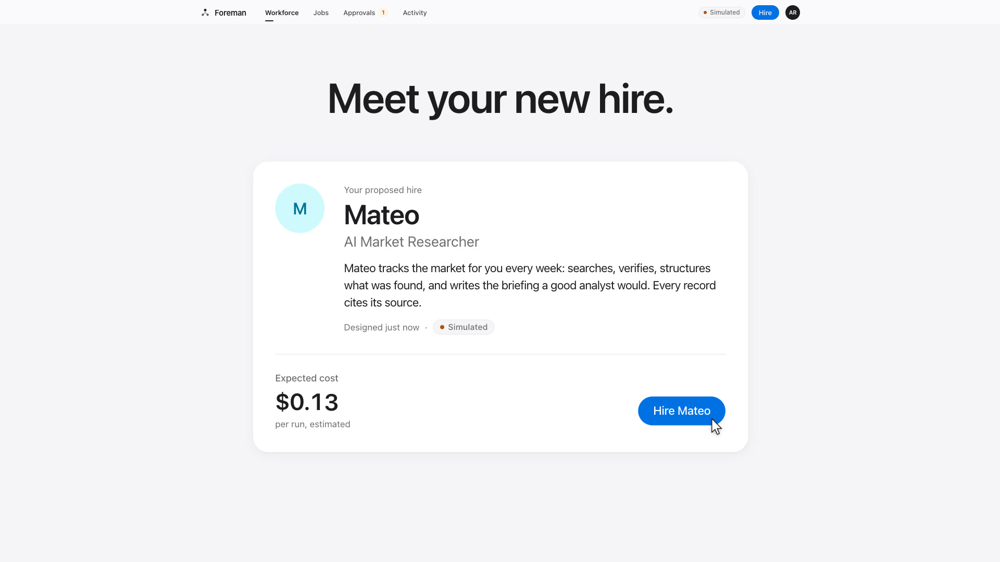

# Foreman

**Foreman is a staffing agency for AI workers.** You describe a job in plain English, Foreman designs a worker for it, and you hire it, read every step of its work, review what it delivers, and replace it when it isn't working out, the way you'd manage a contractor.

It's for people who want recurring AI work (research digests, lead lists, monitoring, reports) done by something they can supervise, not a chat window they have to babysit. It's open source (Apache 2.0) and you run it yourself, with your own AI provider keys. With no keys it runs in a built-in **Simulated mode**, so you can try the whole thing for free.

[](docs/media/foreman-demo.mp4)

*Click the image to watch the 22-second demo.*

---

## Quick start (Docker)

You need [Docker](https://docs.docker.com/get-docker/) with Compose v2.24 or newer (any current Docker Desktop; check with `docker compose version`) and nothing else. No Node.js, no Postgres, no `openssl`.

```bash
git clone https://github.com/karank2512/Foreman.git && cd Foreman
cp .env.example .env        # optional: set ONE of ANTHROPIC_API_KEY / OPENAI_API_KEY / GOOGLE_GENERATIVE_AI_API_KEY (+ optional TAVILY_API_KEY for live web search). No key = Simulated mode.
docker compose up           # first run builds the image; open http://localhost:3000
```

The first run builds the image, which takes a few minutes. After that:

- **Explore the demo workspace** on the sign-in page signs you into *Acme Robotics*, a seeded workspace with three workers, three weeks of run history, deliverables, evaluations, a performance review and one pending approval.
- **Or create your own workspace** at `/sign-up`. You become its owner and can invite teammates from *Settings → Members*.

What the stack does for you:

- `AUTH_SECRET` and `CREDENTIAL_ENCRYPTION_KEY` are generated on first boot and kept in a Docker volume, so sessions and stored credentials survive restarts. Anything you set in `.env` wins.
- The `.env` file is optional. `docker compose up` without one starts in Simulated mode.
- It runs over plain `http://localhost:3000`, with sign-up open and the demo workspace seeded. Set `SIGNUP_MODE=closed` or `DEMO_MODE=false` in `.env` to turn either off.
- Postgres is published on `localhost:5433` in case you want to look at the data.
- Open it at `http://localhost:3000`, not `http://127.0.0.1:3000`: sign-in redirects to `localhost`, and a session cookie set on one address isn't sent to the other. On plain http the app also refuses requests addressed to any other host name, which protects your local copy (and your key) from DNS-rebinding attacks by websites you visit.

Stop with `Ctrl+C` (or `docker compose down`). Your data stays in the `foreman` Docker volumes until you remove them.

---

## Bring your own keys

Foreman has no hosted version and no account with anyone. Every model call is made from your machine with your key, and billed by your provider to your account.

| Variable | What it turns on |
|---|---|
| `ANTHROPIC_API_KEY` | Claude models (Haiku 4.5 / Sonnet 5 / Opus 5) |
| `OPENAI_API_KEY` | OpenAI models (GPT-6 Luna / GPT-6.1 Sol) |
| `GOOGLE_GENERATIVE_AI_API_KEY` | Gemini models (Gemini 3.5 Flash-Lite / Gemini 3.8 Flash) |
| `TAVILY_API_KEY` | Live web search via [Tavily](https://tavily.com). Without it, `web_search` returns simulated results. |

- **Where keys live:** in `.env` only. `.env` is git-ignored and never baked into the Docker image; the containers read it at start-up. After editing it, restart with `docker compose up` (or `npm run dev`). A Tavily key can also be stored per workspace in *Settings → Tool credentials*, where it is encrypted with `CREDENTIAL_ENCRYPTION_KEY`.
- **One key is enough.** Workers ask for a *tier* (fast, standard or reasoning), and each tier goes to the first provider that has a key, in the order Anthropic → OpenAI → Google. To pin a tier to a model, set `MODEL_TIER_FAST|STANDARD|REASONING="<provider>:<model-id>"`, for example `MODEL_TIER_STANDARD=openai:gpt-6.1-sol`.
- **Spend is capped.** Every model and tool call is metered. Real spend counts against a monthly budget per workspace (`PLATFORM_DEFAULT_MONTHLY_BUDGET_USD`, default $25, which owners can change in *Settings → Workspace*). A single run is also capped on cost, tool calls and duration (`PLATFORM_MAX_COST_PER_RUN_USD`, `PLATFORM_MAX_TOOL_CALLS_PER_RUN`, `PLATFORM_MAX_RUN_DURATION_SEC`). All of them are in `.env.example`. These are Foreman's limits. Set a spend limit in your provider's console as well.
- **Check a key before you rely on it.** On the Node path run `npm run smoke:live`; on Docker, `docker compose run --rm --no-deps --entrypoint node web dist/smoke-live.cjs`. Either makes one tiny call per model your key would serve (up to three, a fraction of a cent) and says which one failed and how to fix it. Add `--deep` (`npm run smoke:live -- --deep`) to also try a tool round trip and a structured-output call, which is what real runs do; it costs a cent or two. A rejected key, an empty balance or an unknown model id also shows up in the app with the same fix, the first time Foreman calls the model.
- **The demo workspace never spends your key.** It always runs Simulated, including its scheduled workers, whatever keys are set. Create your own workspace for live work.
- **Simulated mode** is what you get with no model keys, or with `FORCE_SIMULATED=true`. Workers run on a deterministic mock model and simulated tools. Every screen works, including evaluations, performance reviews and Replace, and nothing leaves your machine or costs anything.
- **Which mode am I in?** A **Simulated** chip sits in the top navigation whenever the mock model is in use, and simulated runs and deliverables carry the same badge. *Settings → AI providers* lists each provider as *Live* or *Simulated* and shows which model serves each tier.

---

## Quick start (Node, for development)

Needs Node 22+ and Postgres 14+. If you don't have Postgres, `docker compose up -d db` starts one on `localhost:5433`.

```bash
npm install
npm run setup:local         # writes .env (generated secrets, DATABASE_URL for the compose db on :5433, local defaults); never overwrites existing values
npm run setup:dev           # migrations + demo seed
npm run dev                 # web + worker on http://localhost:3000
npm run smoke:live          # optional: one tiny real call per model your key would serve, to validate keys + model ids
```

If you're using your own Postgres, change `DATABASE_URL` in `.env` before `npm run setup:dev`. `npm run dev` starts the same two processes as production: the Next.js web server and the run worker. Development setup, tests and conventions are in [CONTRIBUTING.md](CONTRIBUTING.md).

Things worth knowing on the Node path:

- **Already ran the Docker stack?** Stop its app first with `docker compose stop web worker` and keep `db` running. `npm run dev` refuses to start while something else is on port 3000. To use another port instead, run `npm run dev -- -p 3001`; sign-in follows the port.
- **It doesn't touch the Docker app.** `setup:local` points `DATABASE_URL` at a separate `foreman_dev` database on the same Postgres, which `setup:dev` creates and seeds. If the Docker stack has already generated its secrets, `setup:local` copies them into `.env` rather than making new ones. That matters because `.env` wins in Docker too, and new secrets there would sign everyone out and make its stored credentials unreadable.
- **Shell variables win over `.env`.** A provider key exported in your shell profile turns on live mode even if `.env` has none. `npm run setup:local` tells you which key it sees and where it comes from.
- **Localhost only.** `npm run dev` listens on `localhost`, not your whole network, because sign-up is open and the demo password is public. [CONTRIBUTING.md](CONTRIBUTING.md) shows how to reach it from another device.

## Quick start (Claude Code)

Open the cloned repo in [Claude Code](https://claude.com/claude-code) and run:

```
/foreman-setup
```

The project skill (`.claude/skills/foreman-setup/SKILL.md`) checks for Docker (or Node and Postgres), creates `.env`, asks whether you want Simulated mode or your own provider, starts the stack, waits until it's ready and shows you how to confirm which mode you're in. It will ask you to paste your API key into `.env` yourself. It never asks for the key in chat.

---

## A tour of the core loop

**Job → Worker → Runs → Deliverables → Evaluation → Replace**

1. **Hire** (`/hire`). Describe the job in a sentence. Foreman asks at most three follow-up questions and writes a **Job Spec** for you to approve. It then proposes a worker, with responsibilities, a pipeline, tools, KPIs and a cost estimate. Click **Hire** and the first run starts right away.
2. **Runs** (`/runs/[id]`). A live timeline of the run in plain language ("Alex searched the web for…"), with model turns, tool calls, deterministic steps, the deliverable and its evaluation. A debug trace is there for engineers.
3. **Approvals** (`/approvals`). Anything that leaves the workspace, such as emailing a report, pauses the run at *Needs approval* and shows exactly what would be sent and to whom. Nothing external happens without a person deciding.
4. **Deliverables** (`/deliverables/[id]`). Accept or reject with feedback. Your decision feeds the worker's score.
5. **The worker's file** (`/workers/[id]`). Overview, activity, deliverables, performance (score, KPIs, trend, **performance reviews**), cost, permissions (tool grants and approval toggles, enforced on the server), **Talk to worker** (questions, one-off instructions, or permanent changes that become a proposed new version), versions and debug.
6. **Replace** (`/workers/[id]/replace/[versionId]`). Foreman looks at failed runs, low scores and rejected deliverables, then proposes a revised worker with a diff and estimated changes in quality, cost and latency. **Hire replacement** retires the old version. The job and its whole history stay.

Workspaces have three roles. *Members* run workers, review deliverables and decide most approvals. *Admins* also hire, replace, change permissions and invite people. *Owners* also manage roles, the budget and workspace settings.

---

## Architecture

- **Two processes, one database.** The Next.js 15 web server serves the product and only ever *enqueues* runs. The worker (`src/worker.ts`) claims runs atomically, heartbeats, recovers crashed runs, runs the scheduler and the retention sweeps. Postgres is the queue, the lease manager and the ledger. There is no Redis or message broker.
- **Blueprints are pipelines, not prompts.** A worker is a `WorkerBlueprint`: an ordered list of *agent* steps (LLM tool-calling loops) and *deterministic* steps (validate, dedupe, rank, stats, CSV, report). Foreman moves as much work as it can into deterministic steps, which is how workers get cheaper over time.
- **Versions are immutable.** A worker version is locked at its first run, so every change is a new version and performance can be compared across versions.
- **Permissions are server-side.** A tool runs only if the version's blueprint includes it, a grant exists, and, for approval-gated tools, a person approved that exact call.
- **One model gateway.** Every LLM call goes through `src/server/models` (Vercel AI SDK v5), which routes tiers to providers, prices each call, enforces budgets and falls back to the deterministic mock.

Stack: Next.js 15 · React 19 · TypeScript · Tailwind v4 · shadcn/ui · Prisma 6 + PostgreSQL · Auth.js v5 · Vercel AI SDK v5 · Zod v4 · Vitest. Module boundaries are in [docs/CONTRACTS.md](docs/CONTRACTS.md), and the design system is in [docs/DESIGN.md](docs/DESIGN.md).

---

## Before you expose it beyond localhost

The Docker quick start is set up for one person on their own machine. Before anyone else can reach it:

- **Set real secrets yourself.** Put `AUTH_SECRET` and `CREDENTIAL_ENCRYPTION_KEY` in `.env` (`openssl rand -base64 32` for each) and keep a copy of the encryption key somewhere other than your database backups. If you lose it, every stored credential becomes unreadable.
- **Serve it over HTTPS** and set `AUTH_URL=https://your.host` so sign-in callbacks are pinned to your origin.
- **Close sign-up.** Use `SIGNUP_MODE=closed` (invitations only) or `SIGNUP_MODE=invite` with a `SIGNUP_INVITE_CODE` of 12 or more characters.
- **Turn off the demo.** Set `DEMO_MODE=false`. The demo account's password is published in this repo, and without `DEMO_MODE` it can't be signed into.
- **Change the database password** from the compose default (`POSTGRES_PASSWORD`) and don't publish port 5433.

[docs/DEPLOYMENT.md](docs/DEPLOYMENT.md) covers the full environment reference, TLS, backups, scaling, health checks (`/api/health`, `/api/ready`) and key rotation. [docs/SECURITY.md](docs/SECURITY.md) covers the threat model and controls.

---

## FAQ

**What does it cost?** Foreman is free. Model and search usage is billed by your providers to your own accounts. In Simulated mode nothing is billed. *Usage* shows spend by day, worker, model and tool, and the per-run and per-workspace caps above stop runaway spend.

**Which models does it use?** By default, for the fast / standard / reasoning tiers: Anthropic `claude-haiku-4-5` / `claude-sonnet-5` / `claude-opus-5`, OpenAI `gpt-6-luna` / `gpt-6.1-sol` / `gpt-6.1-sol`, Google `gemini-3.5-flash-lite` / `gemini-3.8-flash` / `gemini-3.8-flash`. Override any tier with `MODEL_TIER_*`. If a model id is rejected, the key check above (`npm run smoke:live`) calls each model your key would serve and tells you which one failed.

**Where does my data go?** Into the Postgres database on your machine. The only outbound traffic is what your workers do: calls to the model provider whose key you set, Tavily searches if you set that key, and pages the workers fetch through a guarded fetcher that blocks private network ranges. Foreman has no telemetry of its own. The Docker image also turns off Next.js telemetry; on the Node path, run `npx next telemetry disable` if you want the same.

**Does it send email or post to Slack?** Not yet. `send_notification` and `read_dataset` are simulated by design, and sent reports land in an outbox. There is no email provider either, so invitation links are copied and shared by hand and there is no self-service password reset.

**How do I reset everything?**
- Docker: `docker compose down -v` removes the database *and* the generated secrets. The next `docker compose up` starts clean.
- Node: `npm run db:reset` drops and recreates the database in `DATABASE_URL` (`foreman_dev` if `setup:local` wrote it), then re-seeds the demo. `npm run db:seed:demo` rebuilds only the demo workspace.

**Can I change the port?** On Docker, set `WEB_PORT` (default 3000) or `POSTGRES_PORT` (default 5433) in `.env` and open the app on that port. `AUTH_URL` follows `WEB_PORT` unless you've set `AUTH_URL` in `.env` yourself, in which case change both. On Node, run `npm run dev -- -p 3001`. If you move Postgres, update `DATABASE_URL` too.

---

## Tests and scripts

| Command | What it does |
|---|---|
| `npm run dev` | Web server + worker (`npm run dev:web` / `npm run worker` for one half) |
| `npm test` | Vitest suite (1,600+ tests, always in Simulated mode, against a separate `*_test` database; see [CONTRIBUTING.md](CONTRIBUTING.md#tests)) |
| `npm run typecheck` · `npm run lint` | Checks |
| `npm run db:deploy` | Apply migrations |
| `npm run db:seed:demo` | Rebuild the demo workspace (refused in production unless `ALLOW_DEMO_SEED=true`) |
| `npm run build` · `npm run build:worker` | Production web build · bundled worker |
| `npm run smoke:live` | Checks your keys: one tiny real call per model they would serve (Docker: `docker compose run --rm --no-deps --entrypoint node web dist/smoke-live.cjs`) |
| `npm run audit:prod` | Audit production dependencies |

CI (`.github/workflows/ci.yml`) runs migrations, typecheck, lint, tests, both builds and the dependency audit, then checks the compose file without a `.env` and builds the Docker image.

## Contributing

Issues and pull requests are welcome. Start with [CONTRIBUTING.md](CONTRIBUTING.md). If you use Claude Code, [CLAUDE.md](CLAUDE.md) has the rules it follows in this repo. To report a vulnerability, open a private security advisory on GitHub (see [docs/SECURITY.md](docs/SECURITY.md#5-reporting-a-vulnerability)) rather than a public issue.

## License

[Apache License 2.0](LICENSE) © 2026 karank2512. See [NOTICE](NOTICE).
