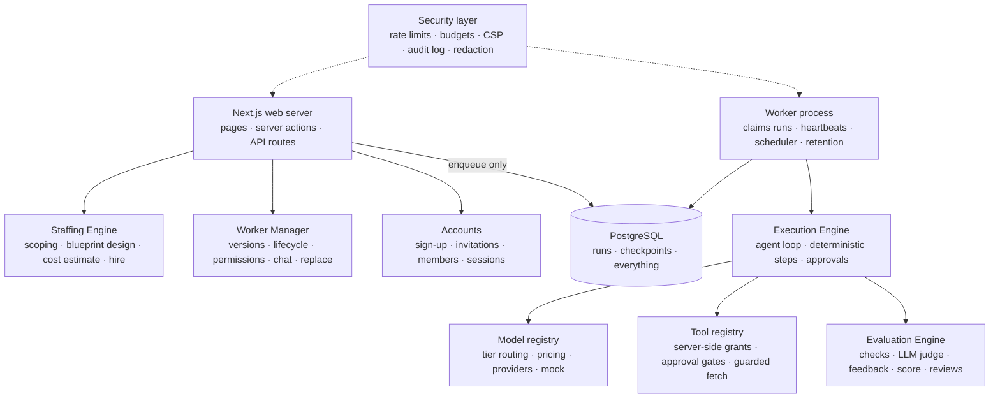

# Foreman

**The staffing agency for AI workers.** Describe a job in plain English; the platform scopes it, designs the right AI worker, puts it to work on a schedule, measures its performance, and lets you improve or replace it — exactly like managing a contractor.

Core loop: **Job → Worker → Runs → Deliverables → Evaluation → Replace.**

A production-ready Next.js application: multi-tenant workspaces with roles and invitations, a durable run engine in its own worker process, server-side permissions and approval gates, spend caps, rate limiting, a nonce-based CSP, a security audit log, health checks, Docker and CI — and a deterministic **Simulated mode** so the whole product works with zero API keys.

---

## Quick start (local)

Prerequisites: Node ≥ 20, PostgreSQL 14+ running locally.

```bash
createdb ai_staffing_agency
cp .env.example .env               # set DATABASE_URL, AUTH_SECRET, CREDENTIAL_ENCRYPTION_KEY (see the file)
npm install                        # also runs prisma generate
npm run setup:dev                  # migrations + the demo workspace
npm run dev                        # web (http://localhost:3000) + worker
```

`npm run dev` starts two processes, the same two that run in production: the Next.js web server and the run worker. Runs are always executed by the worker; the web server only enqueues them.

**Demo workspace.** With `DEMO_MODE=true` in `.env`, the sign-in page offers *Explore the demo workspace*: the seeded "Acme Robotics" org with three workers, three weeks of run history, deliverables, evaluations, a performance review and one pending approval. Without `DEMO_MODE` the demo org cannot be signed into at all.

**Your own workspace.** With `SIGNUP_MODE=open` (the local default), create an account at `/sign-up`; you become the workspace owner and can invite teammates from *Settings → Members*.

### Going live with real models

Add any of `ANTHROPIC_API_KEY`, `OPENAI_API_KEY`, `GOOGLE_GENERATIVE_AI_API_KEY` and restart. Tiers route to the first available provider (Anthropic → OpenAI → Google); override per tier with `MODEL_TIER_FAST|STANDARD|REASONING="<provider>:<model>"`. `TAVILY_API_KEY` (in the env or the *Settings → Tool credentials* vault) enables real web search. Without model keys everything runs in **Simulated mode**, clearly badged in the UI, on a deterministic mock provider and simulated tools. Real spend is capped per workspace by a monthly budget (`PLATFORM_DEFAULT_MONTHLY_BUDGET_USD`, editable by owners).

### Commands

| Command | What it does |
|---|---|
| `npm run dev` | Web server + worker for local development (`npm run dev:web` / `npm run worker` for either half) |
| `npm run build` · `npm run build:worker` | Production web build (standalone) · bundled worker |
| `npm run start:web` · `npm run start:worker` | Run the production builds |
| `npm run typecheck` · `npm run lint` · `npm test` | Checks (tests need `.env.test` + the `ai_staffing_agency_test` database — see [Tests](#tests)) |
| `npm run db:deploy` | Apply migrations (the release step) |
| `npm run setup:dev` · `npm run db:seed:demo` | Migrations + demo data · re-seed the demo workspace (refused in production unless `ALLOW_DEMO_SEED=true`) |
| `npm run audit:prod` | Dependency audit for production dependencies (currently 0 advisories) |

---

## What you can do

1. **Hire** (`/hire`): describe a job → answer at most three follow-up questions → approve a structured **Job Spec** → meet the proposed worker (responsibilities, pipeline, tools, KPIs, cost estimate) → **Hire**. The first run starts immediately.
2. **Watch it work** (`/runs/[id]`): a live timeline of every step in plain language — model turns, tool calls, deterministic steps, the deliverable, the evaluation — with a full debug trace for engineers.
3. **Approve risky actions** (`/approvals`): tools that leave the workspace (sending a report by email) pause the run at *Needs approval* and show exactly what would be sent, including recipients. Nothing external happens without a human decision.
4. **Review deliverables** (`/deliverables/[id]`): accept or reject with feedback — it feeds the worker's score.
5. **Manage the worker** (`/workers/[id]`): overview, activity, deliverables, performance (score, KPIs, trend, reviews), cost, permissions (server-enforced tool grants and approval toggles), *Talk to worker* (questions, one-off instructions, permanent changes that become a proposed version), versions, debug.
6. **Replace** (`/workers/[id]/replace/[versionId]`): the platform analyzes failed runs, low scores and rejected deliverables, proposes a revised worker with a diff and estimated quality/cost/latency deltas; *Hire replacement* retires the old version while the job and its full history survive.
7. **Run the workspace** (`/settings`, `/usage`): members and roles, invitations, budget, password and sessions, recent security events, model providers, tool credentials; spend by day, worker, model and tool.

### Roles

| Role | Can |
|---|---|
| **Member** | View everything, run workers, talk to them, review deliverables, decide approvals for tools without external side effects, request performance reviews |
| **Admin** | Everything above, plus hire, replace, pause and retire workers, change permissions and schedules, approve actions that leave the workspace, manage tool credentials, invite members |
| **Owner** | Everything, plus roles, removing members, the monthly budget and workspace settings |

Permissions are enforced inside the server modules, never only in the UI.

---

## Architecture



Two processes share one Postgres database: the **web server** (Next.js 15 App Router) enqueues work and serves the product; the **worker** (`src/worker.ts`) claims runs atomically, heartbeats, recovers stale runs, runs the scheduler and retention sweeps, and shuts down gracefully. Both can scale horizontally — claim fencing makes multiple workers safe.

Module boundaries and the dependency direction are documented in [`docs/CONTRACTS.md`](docs/CONTRACTS.md):

`domain ← models / simulation / secrets / activity / usage / security ← tools ← evaluation ← runtime ← staffing ← workers / account ← queries / app`

### Key design decisions

- **Blueprints are pipelines, not prompts.** A `WorkerBlueprint` is an ordered list of components sharing a run context: *agent* components (LLM tool-calling loops) and *deterministic* components (validate, dedupe, rank, stats, CSV, report). The Staffing Engine pushes as much work as possible into deterministic steps — which is how workers get cheaper over time.
- **Immutable versions.** `Job → many WorkerVersions → many Runs`. A version is locked once a run references it; every change creates a new version, so performance can be compared across versions.
- **Durable, DB-backed execution.** All executor state lives in Postgres (`Run.checkpoint`). Runs resume idempotently after an approval or a crash; an approved external action never executes twice.
- **Permissions are server-side.** A tool call executes only if the tool is in the version's blueprint, a non-revoked grant exists, and — for approval-gated tools — an approval exists for that exact call. Role checks live in the modules, not the pages.
- **Cost is bounded.** Every model and tool call is metered; real spend counts against a per-workspace monthly budget; blueprint limits are clamped to platform ceilings; scheduling is fair across workspaces.
- **Simulated mode is a first-class product surface.** The mock provider is deterministic and content-aware, so evaluation, health and the Replace flow behave realistically without a single API call.

### Security

Threat model, controls, runbooks and an honest list of residual risks are in [`docs/SECURITY.md`](docs/SECURITY.md). In short: bcrypt(12) passwords with a policy and breached-password list; login throttling and lockout that cannot distinguish accounts; short, revocable sessions; a Postgres-backed rate limiter shared across instances; nonce-based CSP plus the standard header set; org-scoped queries everywhere; approval gates for anything external; a guarded URL fetcher (pinned DNS, private ranges blocked, per-run host allow-list); secrets encrypted with AES-256-GCM bound to their workspace; client-safe error messages with log references; an append-only security event log. Dependency advisories: 0.

To report a vulnerability, see the *Reporting* section of `docs/SECURITY.md`.

### Deployment

[`docs/DEPLOYMENT.md`](docs/DEPLOYMENT.md) covers the environment reference, the first deploy, Docker (`Dockerfile`, `docker-compose.yml`), running the web tier on Vercel with the worker elsewhere, connection pooling, TLS, backups, zero-downtime migrations, health checks (`/api/health`, `/api/ready`), scaling, observability, retention and key rotation. CI (`.github/workflows/ci.yml`) runs migrations, typecheck, lint, tests, both builds and the production dependency audit.

### Code map

```
prisma/                   schema, migrations, demo seed
src/app/                  landing page · (auth) sign-in, sign-up, invite · (app) workforce, hire, jobs, workers, runs, deliverables, approvals, activity, usage, settings · api/health, api/ready
src/components/           UI kit (see src/components/README.md)
src/server/domain/        Zod schemas: JobSpec, WorkerBlueprint, evaluation, replacement, schedule
src/server/account/       sign-up, password policy, invitations, members, workspace settings
src/server/auth/          Auth.js config, credentials, sessions, permissions
src/server/security/      rate limiter, budgets, CSP, audit log, redaction, public errors
src/server/models/        llm — tier routing, pricing, providers, mock provider
src/server/simulation/    deterministic fixtures + mock agent brain
src/server/tools/         registry, permission enforcement, guarded HTTP, the tools
src/server/runtime/       queue, executor, agent loop, deterministic steps, approvals, scheduler
src/server/evaluation/    checks, LLM judge, feedback, score, health, reviews
src/server/staffing/      scoping, family templates, blueprint design, cost estimate, hire
src/server/workers/       versions, lifecycle, permissions, chat, replace
src/server/maintenance/   retention sweeps
src/server/log/           structured logger
src/server/queries/       read-side view models per page
src/worker.ts             the worker process entry
tests/                    Vitest suites per module + tests/e2e
docs/                     CONTRACTS · PRODUCTION · SECURITY · DEPLOYMENT · DESIGN
```

---

## Tests

One-time setup: a separate database plus a `.env.test` next to `.env` (copy `.env.test.example`). The database name must end in `_test`; the suite refuses to run otherwise. Migrations are applied automatically at the start of each run, provider keys are cleared and rate limits are disabled, so tests are hermetic and always run in Simulated mode.

```bash
createdb ai_staffing_agency_test
cp .env.test.example .env.test      # set DATABASE_URL and a CREDENTIAL_ENCRYPTION_KEY
npm test
```

The suite (1,300+ tests) covers schema validation, versioning immutability, run state transitions, atomic claiming, stale-lock recovery and graceful shutdown, server-side permission and role enforcement, approval pause/resume idempotency, rate limiting and lockouts, budgets and quotas, the password policy and invitation lifecycle, session revocation, CSP and header builders, redaction, evaluators and scoring, cost math, the replacement workflow, and a full end-to-end engine test.

---

## Known limitations

- Live provider paths are implemented against the AI SDK v5 types but have only been exercised in Simulated mode in this repository.
- `read_dataset` and `send_notification` are simulated by design (sample datasets, outbox delivery); real connectors (Slack, Gmail, Sheets, HubSpot) and Stripe billing on the usage ledger are next.
- No email provider yet: invitation links are shared by the inviting admin, and there is no self-service password reset. There is no 2FA.
- Light theme only.
